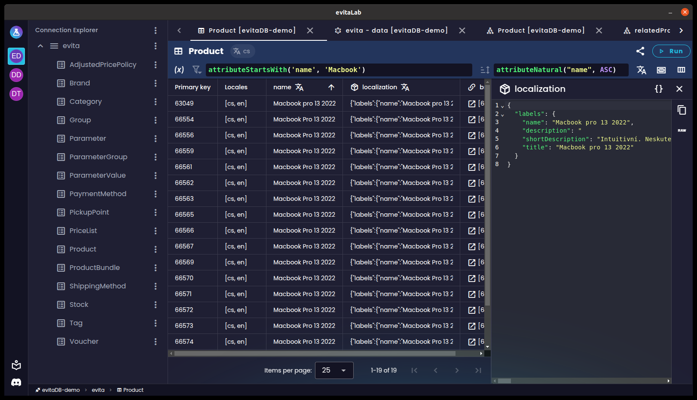

<h1 align="center" style="border-bottom: none">
    <a href="https://evitadb.io" target="_blank"></a><br>evitaLab Desktop
</h1>

<p align="center">
    evitaLab Desktop is the official desktop GUI client for <a href="https://github.com/FgForrest/evitaDB">evitaDB</a> e-commerce database.
</p>

<p align="center">
  <a href="https://github.com/FgForrest/evitalab-desktop/releases" title="Releases"></a>
  &nbsp;
  <a href="https://vuejs.org/" title="Built with Electron"></a>
  &nbsp;
  <a href="https://vuejs.org/" title="Built with Vue"></a>
  &nbsp;
  <a href="https://nodejs.org/en" title="Node.js"></a>
  &nbsp;
  <a href="https://discord.gg/VsNBWxgmSw" title="Discord"></a>
  &nbsp;
  <a href="https://github.com/FgForrest/evitalab-desktop/blob/master/LICENSE" title="License"></a>
</p>

evitaLab Desktop aims to provide a user-friendly local desktop client for evitaDB database to easily browse and modify 
data stored in multiple database instances.



## Features

evitaLab Desktop allows you to:

- ✅ manage connections to multiple evitaDB instances
- ✅ connect to any server version in one app
- ✅ receive evitaLab core updates as soon as they are released without waiting for server update
- ✅ each connection stores its own tabs and history, even if each connection points to same server URL
    - _this is useful when you are using port forwarding for different server environments (prod, test, local) where local port is the same for each environment_
- ✅ connections styling for better distinction between servers and environments
- ✅ global notification system - displays toast notifications from desktop app and connections in one place
    - _this way you can see notifications from all connections all the time_

As well as the features of the [evitaLab core](https://github.com/FgForrest/evitalab)*:

- ✅ inspect schemas
- ✅ browse entities in interactive table
- ✅ execute GraphQL queries
- ✅ execute evitaQL queries
- ✅ visualise extra results
- ✅ share tabs between developers
- ✅ manage server (status, tasks, JFR recordings)
- ✅ manage catalogs and collections
- ✅ analyze server traffic

_* depends on used evitaLab core version based on connected evitaDB server_

However, evitaLab Desktop and evitaLab core are still in active development and more features are planned.

## evitaLab Desktop vs evitaLab

evitaLab Desktop is **not** a replacement for the [evitaLab](https://github.com/FgForrest/evitalab). Instead, it builds on top of the evitaLab.

The evitaLab core is the main heart. It handles opened tabs, consoles, viewers, connection explorer and so on. Basically
everything that has to do with accessing evitaDB server data.

The evitaLab Desktop on the other hand, act as orchestrator of the evitaLab core instances for different evitaDB servers.
The desktop app allows you to connect to several separate evitaDB servers, and for each such connections picks the
appropriate evitaLab version.

This way you can access different evitaDB server versions from a single app without any hassle.

## Download

Binaries are available for all major platforms (Windows, Linux, macOS). You can find them in [releases](https://github.com/FgForrest/evitalab-desktop/releases).

_Note: evitaLab Desktop versioning is separate from the evitaLab core versioning. Just pick the newest desktop app version
no matter your server version._

### macOS

Newer macOS versions quarantine not-signed apps (we are working on it), therefore after installation, macOS may
throw error saying the app is broken. To prevent that, execute following command after installation to get the app out of 
the quarantine:

```shell
cd /Applications
sudo xattr -d com.apple.quarantine evitaLab.app
```

### Other platforms

For other platforms, you will have to clone the repository and configure the [Electron Forge](https://www.electronforge.io/)
config for you platform and build it with:

```bash
yarn install
yarn make
```

_Before you start, make sure you have [Node.js](https://nodejs.org/en/) in version specified in `.nvmrc` and [Yarn](https://yarnpkg.com/)
package manager installed._

## Development

If you would like to contribute to evitaLab Desktop source code or just simply play with it locally, you just need to
clone the project, install the [Node.js](https://nodejs.org/en/) in version specified in `.nvmrc` and [Yarn](https://yarnpkg.com/) (as that's what we use for development)
and run the following commands to run the evitaLab Desktop locally:

```shell
# running using yarn
yarn install
yarn start
```

You can find more indepth info about internal structure and guidelines of evitaLab in [developer documentation](/documentation/developer/index.md).

## Licence

[Apache License 2.0](LICENSE)

## Contribution

Any contributions are welcome and appreciated. If you would like to contribute to evitaLab Desktop or the [evitaLab](https://github.com/FgForrest/evitalab) core, 
feel free to open an issue and submit a pull request.

